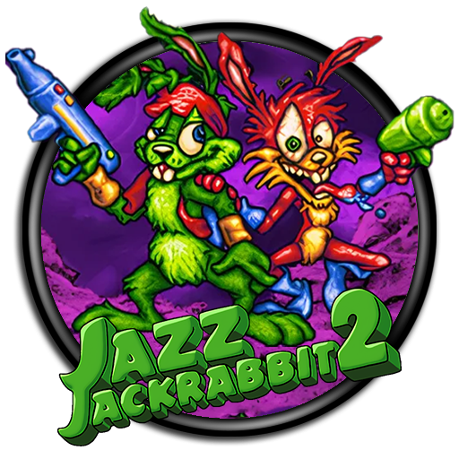
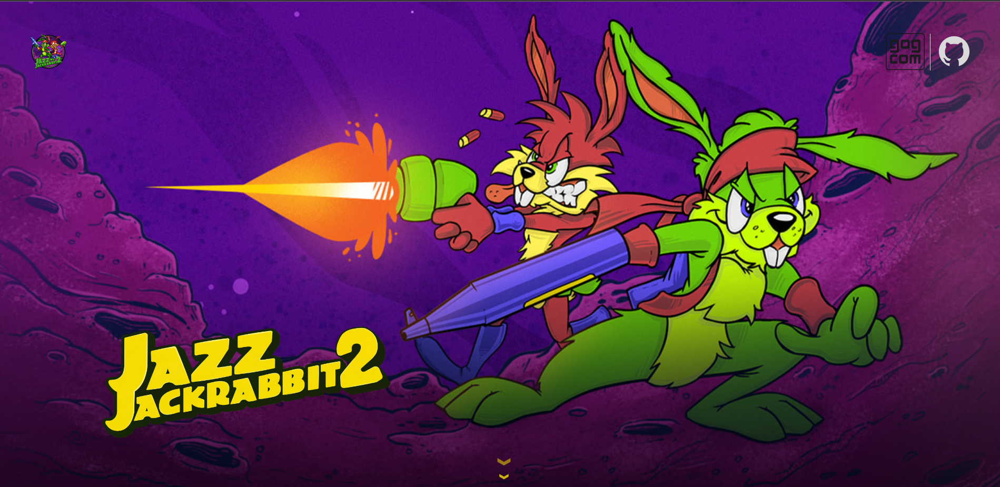

  <h1 align="center">
    Jazz Jackrabbit 2 - Website
     
     
    
  </h1>

## Introduction
This repository hosts the source code and assets for the Jazz Jackrabbit 2 website. The site provides information about the game, including its features, download links, and community resources. It's a central hub for fans of the classic side-scrolling platformer, offering a modern tribute to this beloved game.

Explore, reminisce, and rediscover the magic of Jazz Jackrabbit 2 through our meticulously crafted website. Join us in celebrating this timeless gem of gaming history!

## Features
- *Game Information*: Learn about the game's story, characters, and gameplay mechanics.
- *Download Links*: Access links to download the game and related resources.
- *Modern Tribute*: A contemporary website design that pays homage to the classic game.
- *Contact Developers*: Reach out to the development team for support, feedback, or inquiries.

     
     
    

## Authors
| Nombre | Apellido | Mail | Padrón |
| ------ | -------- | ------ | ------ |
| Ian  | von der Heyde | ivon@fi.uba.ar | 107638 |
| Ignacio Agustín | Sugai | isugai@fi.uba.ar | 109549 |
| Juan Martín | de la Cruz | jdelacruz@fi.uba.ar | 109588 |
| Juan Patricio | Amboage | jamboage@fi.uba.ar | 106892 |

## Acknowledgements
We would like to thank our course instructor **Martín Di Paola** and the Faculty of Engineering for their support and guidance throughout the project. 

## License
MIT License - Copyright (c) 2024 Taller-de-Programacion-1C2024-GRUPO1

